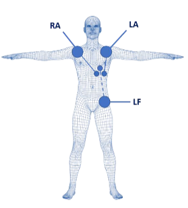

# Laboratorio Nº 5: Adquisición y análisis de señales ECG en distintas condiciones fisiológicas

## 1. Introducción

El electrocardiograma (ECG) es una técnica no invasiva utilizada para registrar la actividad eléctrica del corazón desde la superficie corporal. Debido a su carácter rápido, accesible y de bajo costo, continúa siendo una herramienta fundamental en la evaluación clínica, permitiendo detectar diversas patologías cardiovasculares [1]. Esta señal se origina por la propagación de potenciales de acción a través del tejido cardíaco, lo que da lugar a componentes característicos como la onda P, el complejo QRS y la onda T, asociados a los procesos de despolarización y repolarización del ciclo cardíaco [2].

Para la adquisición del ECG se emplean sistemas de derivaciones que permiten observar la actividad eléctrica desde distintas direcciones. Entre estos, destacan las derivaciones bipolares propuestas por Willem Einthoven (I, II y III). La orientación de estas derivaciones influye en la morfología y amplitud de la señal registrada, así como en su interpretación [3].

En este laboratorio se adquirieron señales ECG utilizando el sistema BITalino y electrodos superficiales, con el objetivo de analizar la variación de la señal bajo distintas condiciones fisiológicas: reposo, hiperventilación, actividad física y contención de la respiración. Asimismo, se evaluó el efecto de factores experimentales como la ubicación de los electrodos, el tipo de derivación y la presencia de artefactos por movimiento, los cuales afectan la calidad y características de la señal adquirida.

---

## 2. Objetivos

### Objetivo general

Adquirir y analizar señales ECG en diferentes condiciones fisiológicas, comparando los cambios observados entre reposo, hiperventilación, post-ejercicio y apnea voluntaria.

### Objetivos específicos

- Registrar señales ECG utilizando las derivaciones I, II y III.
- Comparar la señal basal con señales adquiridas después de hiperventilación, actividad física y contención de la respiración.
- Identificar cambios en la frecuencia cardíaca, intervalos R-R, amplitud y calidad visual de la señal.
- Discutir la coherencia fisiológica de los resultados obtenidos con base en literatura científica reciente.

---

## 3. Metodología

### 3.1. Componentes utilizados

| Componente | Descripción |
|---|---|
| BITalino (r)evolution | Sistema de adquisición de señales biomédicas |
| Sensor ECG BITalino | Módulo utilizado para adquirir la señal electrocardiográfica |
| Electrodos Ag/AgCl desechables | Electrodos superficiales pregelificados |
| Computadora | Equipo utilizado para visualizar, registrar y almacenar las señales |
| OpenSignals | Software empleado para la adquisición de datos |
| Cables de conexión | Conexión entre electrodos, sensor ECG y BITalino |

---

### 3.2. Colocación de electrodos

Se trabajó con configuraciones basadas en las derivaciones de Einthoven:

| Derivación | Configuración general | Descripción |
|---|---|---|
| Derivación I | RA (-) a LA (+) | Mide la diferencia de potencial entre el lado derecho e izquierdo superior del cuerpo |
| Derivación II | RA (-) a LL (+) | Mide la actividad eléctrica desde el lado superior derecho hacia la región inferior izquierda |
| Derivación III | LA (-) a LL (+) | Mide la actividad eléctrica desde el lado superior izquierdo hacia la región inferior izquierda |

Los electrodos se colocaron en una disposición tipo **clavícula-clavícula-cadera**, usando la cadera o cresta ilíaca como referencia. Esta configuración permite aproximar las derivaciones de Einthoven y, al colocar los electrodos cerca de zonas óseas, ayuda a reducir parte del ruido asociado a actividad muscular.




Figura 1. Referencia de la configuración Einthoven [3]


---

### 3.3. Actividades realizadas

El laboratorio se dividió en tres actividades principales.

---

#### Actividad 1: Señal basal e hiperventilación

Primero se adquirió una señal ECG basal durante **30 segundos** con el usuario en reposo y con los electrodos colocados en las tres derivaciones.

Luego, el usuario realizó una fase breve de **hiperventilación**. Inmediatamente después se registró la señal ECG durante **30 segundos** en cada una de las tres derivaciones:

1. Derivación I  
2. Derivación II  
3. Derivación III  

Este procedimiento se repitió **dos veces**, con el objetivo de comparar la variabilidad entre repeticiones y entre derivaciones.

| Condición | Derivación | Duración | Repeticiones |
|---|---|---:|---:|
| Basal | I | 30 s | 1 |
| Hiperventilación | I | 30 s | 2 |
| Hiperventilación | II | 30 s | 2 |
| Hiperventilación | III | 30 s | 2 |

Agregar evidencia:

```markdown

```

---

#### Actividad 2: Señal basal y ejercicio físico

En la segunda actividad se adquirió primero una señal basal del usuario en reposo. Luego, el usuario realizó **10 minutos de actividad física**, subiendo y bajando escaleras.

Al finalizar el ejercicio, se registró la señal ECG durante **30 segundos** en cada derivación, de forma consecutiva:

1. Derivación I  
2. Derivación II  
3. Derivación III  

| Condición | Derivación | Duración |
|---|---|---:|
| Basal | I | 30 s |
| Post-ejercicio | I | 30 s |
| Post-ejercicio | II | 30 s |
| Post-ejercicio | III | 30 s |

Agregar evidencia:

```markdown

```

---

#### Actividad 3: Contención de la respiración

En la tercera actividad, el usuario realizó una contención voluntaria de la respiración durante aproximadamente **20 segundos**. Durante esta condición se adquirió la señal ECG en las tres derivaciones.

| Condición | Derivación | Duración aproximada |
|---|---|---:|
| Apnea voluntaria | I | 20-30 s |
| Apnea voluntaria | II | 20-30 s |
| Apnea voluntaria | III | 20-30 s |

Agregar evidencia:

```markdown

```

---

### 3.5. Procesamiento de la señal ECG

Las señales fueron exportadas desde OpenSignals en formato `.txt` y procesadas en Python mediante Google Colab. 
El flujo general de procesamiento fue el siguiente:

1. Carga de archivos `.txt` exportados desde OpenSignals.
2. Lectura de la señal mediante `opensignalsreader`.
3. Detección automática del canal válido.
4. Centrado de la señal mediante resta de la media.
5. Aplicación de filtro notch a 60 Hz para reducir interferencia eléctrica.
6. Aplicación de filtro pasa banda de 0.5 a 40 Hz para conservar los componentes principales del ECG.
7. Detección de picos R con `find_peaks`.
8. Corrección automática de polaridad en señales invertidas.
9. Cálculo de intervalos R-R.
10. Estimación de frecuencia cardíaca media y mediana.
11. Cálculo descriptivo de métricas HRV: SDNN, RMSSD y pNN50.
12. Generación de gráficas por registro: señal cruda, señal filtrada con picos R, FFT y espectrograma.

La frecuencia de muestreo utilizada en el procesamiento fue:

```python
fs = 1000  # Hz
```

El filtro aplicado fue:

```python
LOWCUT = 0.5      # Hz
HIGHCUT = 40      # Hz
NOTCH_FREQ = 60   # Hz
```

Las métricas principales se calcularon a partir de los picos R detectados:
```python
RR = diferencia temporal entre picos R consecutivos

FC = 60 / RR_promedio
```

Donde `RR` corresponde al intervalo entre dos picos R consecutivos.

---

Debido a que el código de procesamiento es extenso, se decidió colocarlo en un archivo independiente dentro del repositorio. Esto permite mantener el README más ordenado y facilita la revisión del flujo completo de análisis.

El procesamiento completo de las señales ECG se encuentra disponible en el siguiente archivo:

[Ver notebook de procesamiento ECG](./Lab5_bitalino.ipynb)

### 3.6. Variables analizadas

| Variable | Descripción | Unidad |
|---|---|---|
| Duración | Tiempo total del registro | s |
| Número de picos R | Cantidad de complejos QRS detectados | - |
| Intervalo R-R promedio | Tiempo promedio entre picos R consecutivos | s |
| Frecuencia cardíaca media | Frecuencia estimada a partir de los intervalos R-R | bpm |
| Frecuencia cardíaca mediana | Mediana de la frecuencia cardíaca instantánea | bpm |
| SDNN | Desviación estándar de los intervalos R-R | ms |
| RMSSD | Raíz cuadrática media de diferencias sucesivas entre intervalos R-R | ms |
| pNN50 | Porcentaje de diferencias sucesivas mayores a 50 ms | % |
| Polaridad | Orientación detectada de la señal ECG | normal/invertida |

Las métricas SDNN, RMSSD y pNN50 se interpretaron únicamente de manera descriptiva, ya que varias señales tuvieron duraciones cortas de aproximadamente 20 a 30 segundos.

---

## 4. Resultados

### 4.1. Gráficas obtenidas

Para cada señal se generó una figura con cuatro paneles:

1. Señal ECG cruda centrada.
2. Señal ECG filtrada con picos R detectados.
3. Espectro de frecuencia mediante FFT.
4. Espectrograma mediante STFT.

A continuación, se muestran ejemplos representativos por condición.

---

### 4.2. Señal basal


En la condición basal se espera una señal más estable, debido a que el usuario se encontraba en reposo. Esta condición se utilizó como referencia para comparar los cambios observados en las demás actividades.

---

### 4.3. Señal durante hiperventilación


Durante la hiperventilación pueden aparecer cambios en la frecuencia cardíaca y en los intervalos R-R. Además, la respiración rápida puede introducir movimiento torácico y alterar la estabilidad de la línea base.

---

### 4.4. Señal post-ejercicio


En la condición post-ejercicio se observó un aumento evidente de la frecuencia cardíaca. Esto se refleja en una mayor cantidad de picos R por unidad de tiempo y en intervalos R-R más cortos.

---

### 4.5. Señal durante apnea voluntaria


Durante la apnea voluntaria se observaron frecuencias cardíacas elevadas respecto a la condición basal. Esto puede asociarse tanto a cambios autonómicos como a incomodidad, tensión muscular o recuperación incompleta entre actividades.

---

### 4.6. Tabla resumen de resultados

| Condición | Derivación | Duración (s) | Picos R | FC media (bpm) | RR promedio (s) | Observación |
|---|---:|---:|---:|---:|---:|---|
| Basal | I | 31.20 | 43 | 84.51 | 0.727 | Señal invertida detectada |
| Basal | II | 31.05 | 44 | 85.37 | 0.704 | Señal normal |
| Basal | III | 37.20 | 52 | 87.61 | 0.720 | Señal normal |
| Hiperventilación rep. 1 | I | 38.25 | 58 | 91.55 | 0.660 | Aumento leve de FC |
| Hiperventilación rep. 1 | II | 30.60 | 43 | 85.33 | 0.708 | Similar a basal |
| Hiperventilación rep. 1 | III | 31.35 | 44 | 83.56 | 0.723 | Similar a basal |
| Hiperventilación rep. 2 | I | 30.30 | 44 | 89.92 | 0.684 | Señal invertida detectada |
| Hiperventilación rep. 2 | II | 32.10 | 47 | 88.40 | 0.683 | Aumento leve de FC |
| Hiperventilación rep. 2 | III | 36.00 | 53 | 88.71 | 0.684 | Aumento leve de FC |
| Post-ejercicio | I | 30.75 | 80 | 157.01 | 0.383 | Mayor FC registrada |
| Post-ejercicio | II | 31.65 | 72 | 137.21 | 0.438 | FC elevada |
| Post-ejercicio | III | 60.60 | 126 | 124.83 | 0.481 | FC elevada, registro más largo |
| Apnea | I | 21.45 | 49 | 136.36 | 0.440 | FC elevada |
| Apnea | II | 21.90 | 46 | 127.12 | 0.472 | FC elevada |
| Apnea | III | 28.80 | 62 | 129.02 | 0.465 | FC elevada |

---

### 4.7. Comparación global de frecuencia cardíaca


La frecuencia cardíaca media en condición basal se mantuvo aproximadamente entre 84 y 88 bpm. Durante la hiperventilación, los valores se mantuvieron cercanos a la condición basal, con aumentos leves en algunos registros. En la condición post-ejercicio se observaron los valores más altos, especialmente en la derivación I, donde la frecuencia cardíaca media fue aproximadamente 157 bpm. Durante la apnea también se registraron valores elevados, entre 127 y 136 bpm.

---

### 4.8. Comparación respecto al promedio basal

El promedio de frecuencia cardíaca basal de la Actividad 1 fue utilizado como referencia descriptiva. Esta comparación debe interpretarse con cautela, ya que no se registró una señal basal inmediatamente antes de las actividades de ejercicio y apnea.

| Condición | Derivación | FC media (bpm) | Diferencia vs basal (bpm) |
|---|---:|---:|---:|
| Hiperventilación rep. 1 | I | 91.55 | +5.72 |
| Hiperventilación rep. 1 | II | 85.33 | -0.50 |
| Hiperventilación rep. 1 | III | 83.56 | -2.27 |
| Hiperventilación rep. 2 | I | 89.92 | +4.09 |
| Hiperventilación rep. 2 | II | 88.40 | +2.57 |
| Hiperventilación rep. 2 | III | 88.71 | +2.88 |
| Post-ejercicio | I | 157.01 | +71.18 |
| Post-ejercicio | II | 137.21 | +51.38 |
| Post-ejercicio | III | 124.83 | +39.00 |
| Apnea | I | 136.36 | +50.53 |
| Apnea | II | 127.12 | +41.29 |
| Apnea | III | 129.02 | +43.19 |


---

## 5. Discusión

### 5.1. Coherencia fisiológica de los resultados 
Los resultados obtenidos fueron coherentes con las condiciones fisiológicas evaluadas. En reposo, la frecuencia cardíaca basal se mantuvo entre 84 y 88 bpm, funcionando como referencia inicial del participante. Durante la hiperventilación, nuestros resultados mostraron cambios leves en la frecuencia cardíaca respecto al estado basal. La frecuencia cardíaca basal estuvo entre 84 y 88 bpm, mientras que durante hiperventilación los valores se mantuvieron aproximadamente entre 83 y 92 bpm. El mayor aumento se observó en la repetición 1 de la derivación I, con 91.55 bpm, lo que representa un incremento moderado frente al promedio basal. Estos resultados son parcialmente consistentes con lo reportado por Spiesshoefer et al. [4], quienes evaluaron los efectos de la hiperventilación voluntaria sobre parámetros hemodinámicos y de balance simpático-vagal. En sujetos sanos, los autores encontraron que la hiperventilación voluntaria se asoció con predominio simpático, una disminución del 50% en la sensibilidad barorrefleja media y un aumento del 29% en el índice cardíaco respecto al basal. Esto sugiere que la hiperventilación puede generar una respuesta autonómica y cardiovascular medible. Sin embargo, en nuestro caso el aumento de frecuencia cardíaca fue pequeño y no se observó de forma uniforme en todas las derivaciones. Esta diferencia puede deberse a varios factores metodológicos. Por tanto, los resultados sugieren que la hiperventilación produjo una respuesta cardiovascular leve, pero no permiten afirmar una activación autonómica marcada como la observada en estudios controlados. 

En la condición post-ejercicio se observó el mayor incremento de frecuencia cardíaca. El promedio basal fue de aproximadamente 85.83 bpm, mientras que después de subir y bajar escaleras la frecuencia cardíaca alcanzó 157.01 bpm en la derivación I, 137.21 bpm en la derivación II y 124.83 bpm en la derivación III. Esto representa incrementos de +71.18, +51.38 y +39.00 bpm respecto al basal, respectivamente. Este aumento es consistente con la literatura, ya que la subida de escaleras es una actividad capaz de generar una respuesta cardiovascular medible. En la literatura se reporta que subir entre 5 y 10 m de altitud puede aumentar la frecuencia cardíaca en aproximadamente 20–30 bpm, y propusieron la subida de escaleras como una alternativa práctica para evaluar la recuperación de frecuencia cardíaca post-ejercicio [5]. En nuestro caso, el incremento fue mayor, lo cual puede explicarse porque el participante realizó 10 minutos de actividad física continua subiendo y bajando escaleras, en lugar de una prueba breve y estandarizada.

Además, se observó una disminución progresiva de la frecuencia cardíaca entre las derivaciones I, II y III. Esto probablemente refleja el proceso de recuperación cardíaca, ya que las derivaciones fueron registradas de forma consecutiva y no simultánea. Por ello, la diferencia entre derivaciones no debe atribuirse únicamente al eje eléctrico de medición, sino también al tiempo transcurrido después del ejercicio.

Durante la apnea voluntaria, la frecuencia cardíaca se mantuvo elevada, con valores entre 127.12 y 136.36 bpm, frente a un promedio basal aproximado de 85.83 bpm. Este resultado no coincide completamente con lo reportado por Hassan et al. [6], quienes compararon respiración normal y "breath holding" en sujetos sanos y encontraron que la frecuencia cardíaca promedio fue 8% menor durante "breath holding". En nuestro caso, la FC aumentó entre +41.29 y +50.53 bpm respecto al basal, lo cual sugiere que la maniobra pudo no haberse realizado en una condición de reposo controlado. También pudieron influir la incomodidad, tensión muscular, ansiedad o recuperación incompleta.

Finalmente, las métricas de variabilidad de la frecuencia cardíaca (HRV) en el dominio del tiempo (SDNN, RMSSD y pNN50) se consideraron únicamente de forma descriptiva. Aunque es posible calcularlas a partir de los registros obtenidos, la duración de 20–30 s resulta limitada para un análisis robusto, especialmente en condiciones dinámicas como el ejercicio o la recuperación. Estudios recientes han mostrado que, si bien es posible estimar HRV en ventanas ultracortas, en contextos no estáticos se requieren tiempos de medición mayores (≥120 s) para obtener resultados confiables, e incluso algunas métricas pueden no ser válidas en estas condiciones [7].

---
### 5.2. Limitaciones 

La principal limitación fue que el laboratorio se realizó con un solo participante, por lo que los resultados no pueden generalizarse. Además, la señal basal solo fue registrada durante la Actividad 1, por lo que las comparaciones con post-ejercicio y apnea deben interpretarse de forma descriptiva.

Otra limitación importante fue que las derivaciones I, II y III fueron adquiridas de manera consecutiva y no simultánea. Esto afecta especialmente la condición post-ejercicio, ya que la frecuencia cardíaca disminuye progresivamente durante la recuperación. Por ello, parte de la diferencia entre derivaciones puede deberse al tiempo transcurrido después del esfuerzo.

Asimismo, se debe considerar que los registros fueron cortos. Aunque permiten estimar frecuencia cardíaca y detectar picos R, no son ideales para un análisis completo de HRV. Por ello, las métricas SDNN, RMSSD y pNN50 no deben interpretarse como resultados clínicos concluyentes.

---

## 6. Conclusiones

Se logró adquirir y procesar señales ECG en las derivaciones I, II y III usando BITalino y Python. La condición basal presentó frecuencias cardíacas medias entre 84 y 88 bpm, mientras que la hiperventilación produjo cambios leves respecto al reposo.

La condición post-ejercicio generó el mayor incremento de frecuencia cardíaca, alcanzando hasta 157.01 bpm, lo cual es coherente con la respuesta cardiovascular al esfuerzo físico. Durante la apnea también se observaron frecuencias elevadas, aunque su interpretación requiere cautela por la ausencia de un baseline inmediato previo.

Las diferencias entre derivaciones se explican por la orientación del eje eléctrico, la posición de los electrodos y posibles variaciones en el contacto electrodo-piel. Algunas señales invertidas no invalidan el registro, siempre que los picos R sean identificables.

Para futuros laboratorios se recomienda registrar un baseline antes de cada actividad, adquirir derivaciones de forma simultánea si es posible, controlar mejor las condiciones respiratorias y mantener tiempos de registro homogéneos.

---

## 7. Referencias

1.  N. Rafie, A. H. Kashou, and P. A. Noseworthy, “ECG Interpretation: Clinical Relevance, Challenges, and Advances,” Hearts, vol. 2, no. 4, pp. 505–513, 2021.
2.  Fundamentals of the electrocardiogram and common cardiac arrhythmias, 2024. https://doi.org/10.1016/j.mpaic.2023.11.014
3.  PLUX Wireless Biosignals, BITalino (r)evolution Home Guide #2: Electrocardiography (ECG), 2021.
4.  J. Spiesshoefer, S. Becker, I. Tuleta, M. Mohr, G. P. Diller, M. Emdin, A. R. Florian, A. Yilmaz, M. Boentert, and A. Giannoni, “Impact of simulated hyperventilation and periodic breathing on sympatho-vagal balance and hemodynamics in patients with and without heart failure,” *Respiration*, vol. 98, no. 6, pp. 482–494, 2019, doi: 10.1159/000502155.
5.  D. Sokas, A. Rapalis, A. Petrenas, S. Daukantas, and V. Marozas, “Evaluation of stair climbing as an approach for estimating heart rate recovery in daily activities,” in *BIOSTEC 2021: Proceedings of the 14th International Joint Conference on Biomedical Engineering Systems and Technologies, Vol. 4: BIOSIGNALS*, B. Bracken, A. Fred, and H. Gamboa, Eds. Setúbal, Portugal: SciTePress, 2021, pp. 21–25, doi: 10.5220/0010184500210025.
6.  T. Hassan, B. Rahman, R. H. Sandler, and H. A. Mansy, “Effect of normal breathing and breath holding on seismocardiographic signals and heart rate,” in *Proc. IEEE Signal Processing in Medicine and Biology Symposium (SPMB)*, 2021.
7.  Y. S. Kim, J. H. Shin, y J. H. Lee, “Ultra-short-term heart rate variability under dynamic conditions,” Frontiers in Physiology, vol. 12, art. 596060, 2021, doi: 10.3389/fphys.2021.596060.
   

